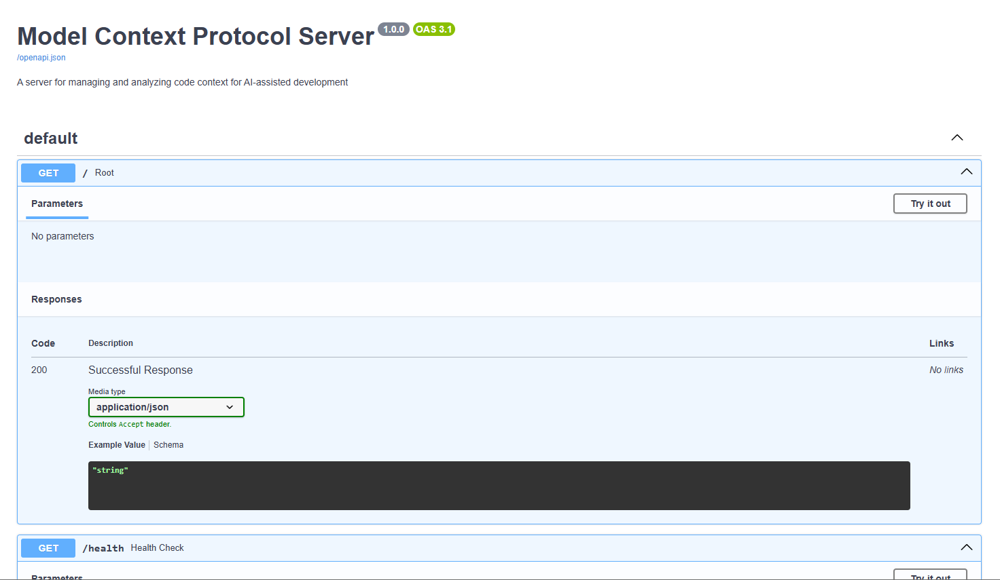

# Vibe Model Context Protocol Server (VMCPS)

A Python-based server for managing and analyzing code context for AI-assisted development.


## Features

- Real-time code analysis and context generation
- Automatic file change detection
- Secure authentication and authorization
- RESTful API for context management
- Project structure analysis
- Dependency tracking
- Cross-platform support (Windows, Linux, macOS)

## API Endpoints

- `POST /token` - Get authentication token
- `POST /analyze` - Analyze a project
- `GET /context` - Get context for a file or project
- `GET /dependencies` - Get project dependencies
- `GET /structure` - Get project structure

## Security

- JWT-based authentication
- Password hashing with bcrypt
- CORS protection
- Environment-based configuration

## Installation

1. Clone the repository:
```bash
git clone https://github.com/non-npc/Vibe-Model-Context-Protocol-Server.git
cd mcps
```

2. Create a virtual environment:
```bash
python -m venv venv
source venv/bin/activate  # On Windows: venv\Scripts\activate
```

3. Install dependencies:
```bash
pip install -r requirements.txt
```

4. Configure environment variables:
- Copy `.env.example` to `.env`
- Update the values in `.env` as needed

## Example API Usage (curl commands)

Start the server:
```bash
python -m mcps.main
```

1. Get token:
```bash
curl -X POST "http://localhost:8000/token" -H "Content-Type: application/x-www-form-urlencoded" -d "username=admin&password=admin"
```

2. Analyze project (replace <token> with actual token):
```bash
curl -X POST "http://localhost:8000/analyze" -H "Authorization: Bearer <token>" -H "Content-Type: application/json" -d '{"project_path": "/path/to/your/project"}'
```

3. Get context:
```bash
curl -X GET "http://localhost:8000/context" -H "Authorization: Bearer <token>"
```

Access the API:
- The server will be running at `http://localhost:8000`
- API documentation is available at `http://localhost:8000/docs`

## Development

1. Install development dependencies:
```bash
pip install -r requirements-dev.txt
```

2. Run tests:
```bash
pytest
```

## Contributing

1. Fork the repository
2. Create a feature branch
3. Commit your changes
4. Push to the branch
5. Create a Pull Request

## License

[MIT License](LICENSE)
